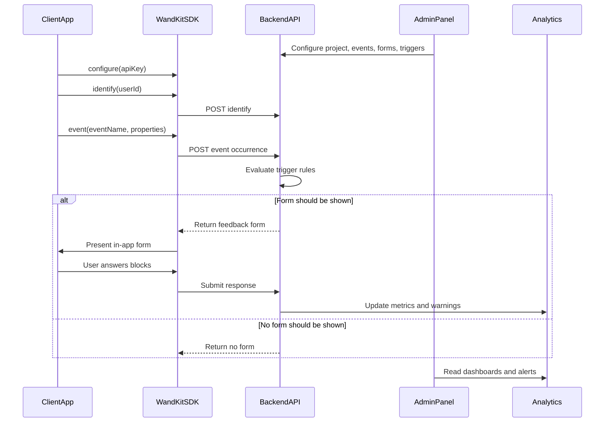

# WandKit Project Specification

## 1. Product Summary

WandKit is a SaaS platform for collecting contextual feedback from client applications. A client app reports meaningful product events to WandKit, and WandKit decides whether that event should trigger a feedback form. If a form should be shown, the client SDK presents a short in-app feedback flow and submits the user's answers back to the platform.

The admin panel lets customer teams define projects, events, feedback forms, and trigger rules. It also turns collected responses into analytics, warnings, and product insights so teams can see what is working, what is frustrating users, and where instrumentation is missing.

The core promise is: ask the right user the right question at the right moment, then make the answers useful for product teams.

## 2. Goals

- Give product teams a lightweight way to collect feedback inside their own apps.
- Let teams connect feedback to concrete product moments, not only generic surveys.
- Keep SDK integration simple: configure the SDK, identify the user, and report events.
- Let admins create and change feedback logic without shipping client app updates.
- Show analytics that combine event health, response quality, and feedback trends.
- Warn teams when important events are not firing enough or when feedback becomes negative.

## 3. Non-Goals For The First Version

- Replacing full analytics platforms such as Amplitude, Mixpanel, or Firebase.
- Building a complex no-code survey product with every possible question type.
- Supporting every client platform on day one.
- Running automated customer support workflows from feedback responses.
- Providing billing, invoicing, and enterprise permissions before the core feedback loop works.

## 4. Core Users

### Customer Admin

A customer admin configures WandKit for their company. They create projects, manage API keys, define events, build feedback forms, configure triggers, and review analytics.

### Product Manager

A product manager uses WandKit to understand user sentiment around specific moments: onboarding completion, checkout, cancellation, feature adoption, support interactions, or errors.

### Developer

A developer integrates the SDK into the client app, reports events, identifies users when possible, and validates that events are reaching the backend.

### End User

An end user interacts with the customer's app. When a configured event occurs, they may see a small feedback form and choose to answer or dismiss it.

### WandKit Platform

The WandKit platform receives SDK traffic, evaluates triggers, returns forms, stores responses, computes analytics, and generates warnings.

## 5. System Components

### Client SDK

The SDK is embedded into a customer application. For the current repository, this is the iOS SDK package.

Responsibilities:

- Store SDK configuration such as API key, external user ID, and device ID.
- Send `identify` requests when the app knows the current user.
- Send event requests when the app calls `WandKit.event(...)`.
- Render feedback forms returned by the backend.
- Collect answers for feedback blocks.
- Submit impressions, dismissals, and responses.
- Fail quietly when the network is unavailable or no form should be shown.

### Backend API

The backend API is the source of truth for projects, events, forms, trigger rules, responses, and analytics.

Responsibilities:

- Authenticate SDK requests by API key.
- Authenticate admin panel users by session or token.
- Receive event occurrences from SDKs.
- Evaluate whether an event occurrence should show a form.
- Return form payloads to SDKs.
- Store impressions, dismissals, partial submissions, and completed responses.
- Aggregate analytics and detect warning conditions.

### Admin Panel

The admin panel is the web application used by customer teams.

Responsibilities:

- Create and manage organizations and projects.
- Display installation instructions and API keys.
- Define tracked events and expected event volume.
- Configure feedback forms and form blocks.
- Attach forms to events through trigger rules.
- Show response analytics, event health, warnings, and raw feedback.

### Analytics And Warning Layer

The analytics layer transforms raw event and response data into useful summaries.

Responsibilities:

- Track event volume over time.
- Track form impressions, starts, completions, skips, and dismissals.
- Surface ratings, sentiment, common choices, and text feedback trends.
- Warn when important events are underreported.
- Warn when feedback quality drops below configured thresholds.

## 6. High-Level Lifecycle



## 7. Domain Model

### Organization

A company or team using WandKit. An organization owns projects, members, billing settings, and shared permissions.

Important fields:

- `id`
- `name`
- `members`
- `createdAt`

### Project

A single app, product, or environment that sends events to WandKit. Projects own API keys, events, forms, responses, and analytics.

Important fields:

- `id`
- `organizationId`
- `name`
- `environment`
- `apiKeys`
- `createdAt`

### API Key

A secret used by SDKs to authenticate traffic for a project. API keys should be scoped to one project and one environment.

Important fields:

- `id`
- `projectId`
- `name`
- `keyHash`
- `prefix`
- `createdAt`
- `revokedAt`

### User

The person using a customer app. WandKit should support both anonymous users and identified users.

Important fields:

- `id`
- `projectId`
- `externalUserId`
- `deviceId`
- `firstSeenAt`
- `lastSeenAt`

### Event

A named product moment that the client app reports.

Examples:

- `onboarding_completed`
- `checkout_completed`
- `subscription_cancelled`
- `feature_used`
- `support_ticket_created`
- `payment_failed`

Important fields:

- `id`
- `projectId`
- `name`
- `description`
- `expectedVolume`
- `isCritical`
- `createdAt`

### Event Occurrence

A single time an event happened in a client app.

Important fields:

- `id`
- `projectId`
- `eventId`
- `userId`
- `properties`
- `occurredAt`
- `receivedAt`
- `sdkPlatform`
- `sdkVersion`

### Trigger

A rule that decides whether an event occurrence should show a feedback form.

Trigger examples:

- Show after `checkout_completed`.
- Show only to users on plan `pro`.
- Show at most once per user per 30 days.
- Show to 10% of matching users.
- Show only after the event has happened 3 times for the same user.
- Do not show if the user has already completed the same form.

Important fields:

- `id`
- `projectId`
- `eventId`
- `formId`
- `name`
- `conditions`
- `samplingRate`
- `cooldown`
- `priority`
- `isEnabled`

### Form

A feedback flow shown to the end user.

Important fields:

- `id`
- `publicId`
- `projectId`
- `title`
- `description`
- `blocks`
- `status`
- `createdAt`
- `updatedAt`

### Form Block

One question or input inside a feedback form.

Supported MVP block types:

- `stars`: numeric rating, commonly 1 to 5.
- `thumbs`: positive or negative binary feedback.
- `multi_choice`: one or more predefined options.
- `text`: free-text feedback with optional length limit.

Important fields:

- `id`
- `formId`
- `type`
- `label`
- `required`
- `options`
- `allowMultiple`
- `maxLength`
- `placeholder`
- `position`

### Impression

A record that a form was returned to or displayed by an SDK.

Important fields:

- `id`
- `projectId`
- `eventOccurrenceId`
- `formId`
- `userId`
- `shownAt`
- `dismissedAt`
- `completedAt`
- `status`

### Response

Answers submitted for a form impression.

Important fields:

- `id`
- `projectId`
- `formId`
- `impressionId`
- `userId`
- `answers`
- `submittedAt`

### Insight

A computed finding shown in the admin panel.

Examples:

- "Checkout feedback dropped from 4.6 to 3.8 stars this week."
- "Payment failed events increased 24% and feedback is mostly negative."
- "The onboarding completed event has not fired in production for 3 days."

### Alert

A warning generated from event health, response trends, or configured thresholds.

Important fields:

- `id`
- `projectId`
- `type`
- `severity`
- `title`
- `message`
- `status`
- `createdAt`
- `resolvedAt`

## 8. SDK Behavior

The current iOS SDK exposes three public entry points:

```swift
WandKit.configure(apiKey: "your-api-key")
WandKit.identify("user_123")
WandKit.event(
    "checkout_completed",
    properties: [
        "plan": "pro",
        "source": "paywall"
    ]
)
```

### `configure(apiKey:)`

Stores the project API key used for SDK requests. The SDK should be configured once during app startup.

Expected behavior:

- Store the key in SDK memory or local configuration.
- Attach the key to SDK API requests.
- Avoid showing feedback forms until configuration exists.

### `identify(_:)`

Associates the current device/session with a customer-provided user ID.

Expected behavior:

- Store the external user ID locally.
- Send the user ID to the backend.
- Let the backend connect future event occurrences and responses to the same user.
- Support anonymous operation when the app does not identify a user.

### `event(_:properties:occurredAt:)`

Reports a product event to WandKit. This is the main SDK call that can trigger feedback.

Expected behavior:

- Send event name, optional properties, occurrence time, user identity, device ID, SDK platform, and SDK version.
- Receive either a feedback form or a no-form response.
- Present the form only when the backend returns one.
- Submit impression and answer data.
- Never block the host app's primary user flow.

## 9. API Contract Draft

The exact endpoint names can evolve, but the API should preserve these responsibilities.

### Identify User

Request:

```http
POST /identify
X-API-Key: <project-api-key>
Content-Type: application/json
```

```json
{
  "userId": "user_123"
}
```

Expected result:

- Creates or updates a WandKit user for the project.
- Associates the external user ID with the current device when device information is available.

### Report Event

Request:

```http
POST /api/v1/sdk/events
X-API-Key: <project-api-key>
Content-Type: application/json
```

```json
{
  "eventName": "checkout_completed",
  "user": {
    "externalUserId": "user_123",
    "deviceId": "device_abc"
  },
  "properties": {
    "plan": "pro",
    "source": "paywall"
  },
  "occurredAt": "2026-04-27T13:00:00.000Z",
  "sdk": {
    "platform": "ios",
    "version": "1.4.0"
  }
}
```

Response when a form should be shown:

```json
{
  "eventId": "evt_123",
  "form": {
    "publicId": "form_abc",
    "impressionId": "imp_123",
    "title": "How was your checkout experience?",
    "description": "Tell us what went well and what we can improve.",
    "blocks": [
      {
        "id": "rating",
        "type": "stars",
        "label": "Rate your experience",
        "required": true
      },
      {
        "id": "feedback",
        "type": "text",
        "label": "Anything else you would like to share?",
        "required": false,
        "maxLength": 280,
        "placeholder": "Write your feedback here"
      }
    ]
  }
}
```

Response when no form should be shown:

```json
{
  "eventId": "evt_123",
  "form": null
}
```

The exact no-form shape can be finalized during backend implementation. A nullable `form`, a dedicated `shouldShowForm` flag, or a `204 No Content` response are all acceptable if the SDK can clearly distinguish "event accepted, do not show UI" from an error.

### Submit Feedback Response

Request:

```http
POST /api/v1/sdk/responses
X-API-Key: <project-api-key>
Content-Type: application/json
```

```json
{
  "impressionId": "imp_123",
  "formPublicId": "form_abc",
  "answers": [
    {
      "blockId": "rating",
      "type": "stars",
      "value": 5
    },
    {
      "blockId": "feedback",
      "type": "text",
      "value": "Checkout was quick and clear."
    }
  ],
  "submittedAt": "2026-04-27T13:01:30.000Z"
}
```

Expected result:

- Stores answers against the impression and form.
- Marks the impression as completed.
- Updates analytics asynchronously.

### Track Dismissal

Request:

```http
POST /api/v1/sdk/impressions/{impressionId}/dismiss
X-API-Key: <project-api-key>
Content-Type: application/json
```

Expected result:

- Marks the impression as dismissed.
- Helps calculate form acceptance and completion rates.

## 10. Admin Panel Specification

### Dashboard

The dashboard should answer:

- Are events being received?
- Which events are healthy, underreported, or broken?
- Which forms are collecting useful responses?
- Is feedback improving or getting worse?
- What needs the team's attention today?

Recommended widgets:

- Event volume over time.
- Active warnings.
- Average star rating by form and event.
- Thumbs positive/negative ratio.
- Form impression and completion funnel.
- Recent negative feedback.
- Top selected multi-choice options.

### Project Setup

Admins should be able to:

- Create a project.
- Choose an environment such as development, staging, or production.
- Generate and revoke API keys.
- Copy SDK installation and quick-start instructions.
- See whether the SDK has sent its first event.

### Event Management

Admins should be able to:

- Create known events manually.
- Discover events automatically when SDK traffic arrives.
- Add descriptions so the team understands each event.
- Mark events as critical.
- Set expected volume ranges.
- View recent occurrences and properties.

### Form Builder

Admins should be able to:

- Create forms with title and description.
- Add, reorder, edit, and delete blocks.
- Preview forms as they will appear in client apps.
- Save drafts before publishing.
- Version forms so analytics remain tied to the form users actually saw.

MVP validation rules:

- A published form must have at least one block.
- Required blocks must have labels.
- `multi_choice` blocks must have at least two options.
- `text` blocks should have a reasonable maximum length.
- A form cannot be deleted if it has collected responses; it should be archived instead.

### Trigger Configuration

Admins should be able to:

- Attach a form to an event.
- Enable or disable a trigger.
- Configure basic property matching.
- Configure sampling rate.
- Configure per-user cooldown.
- Configure maximum impressions per user.
- Preview whether a sample event would match the trigger.

MVP trigger conditions should stay simple:

- Event name equals configured event.
- Property equals a string value.
- Property exists.
- User has not seen this form recently.
- Random sampling passes.

### Responses

Admins should be able to:

- Browse individual responses.
- Filter by project, event, form, date range, rating, and sentiment.
- See the event properties that led to the response.
- Export responses as CSV in a later version.
- Mark responses as reviewed in a later version.

### Analytics

Admins should be able to see:

- Event count by day.
- Unique users by event.
- Form impressions by event.
- Form start rate.
- Form completion rate.
- Average star rating.
- Thumbs positive/negative ratio.
- Multi-choice option distribution.
- Text response count.
- Negative feedback count.

### Warnings

Warnings should be actionable and explain why they were generated.

Warning examples:

- Critical event has no traffic.
- Event volume is below expected range.
- Event volume changed sharply.
- Form completion rate is low.
- Average rating dropped below threshold.
- Negative thumbs ratio is high.
- Text feedback contains repeated complaints.

Each warning should include:

- A clear title.
- Severity.
- Affected project, event, or form.
- Time range.
- Supporting metric.
- Suggested next action.
- Status: open, acknowledged, resolved, or ignored.

## 11. Analytics Rules

### Event Health

Event health helps teams know whether instrumentation works.

Suggested metrics:

- `events_received`: total event occurrences.
- `unique_users`: users or devices that fired the event.
- `last_seen_at`: latest received event.
- `expected_minimum`: configured lower bound for the time window.
- `health_status`: healthy, low_volume, missing, or unknown.

Suggested warning logic:

- Missing: critical event has zero occurrences in the configured time window.
- Low volume: event count is below the configured expected minimum.
- Spike or drop: event count changes significantly compared with the previous comparable period.

### Feedback Quality

Feedback quality helps teams know whether a product moment is performing well.

Suggested metrics:

- Average star rating.
- Rating distribution.
- Positive thumbs percentage.
- Negative thumbs percentage.
- Completion rate.
- Dismissal rate.
- Common selected options.
- Text response themes.

Suggested warning logic:

- Average star rating falls below a configured threshold.
- Negative thumbs responses exceed a configured percentage.
- Completion rate falls below a configured threshold.
- A form gets impressions but almost no responses.

## 12. MVP Scope

### Must Have

- iOS SDK can configure with API key.
- iOS SDK can identify a user.
- iOS SDK can report events.
- Backend can authenticate SDK event requests.
- Backend can return either no form or a configured form.
- iOS SDK can render stars, thumbs, multi-choice, and text blocks.
- SDK can submit completed responses.
- Admin panel can create projects, API keys, events, forms, and triggers.
- Admin panel can show basic event volume and response analytics.
- Admin panel can warn about missing or low-volume critical events.

### Should Have

- Form drafts and publishing.
- Trigger cooldowns and sampling.
- Dismissal tracking.
- Basic negative feedback warnings.
- Response filtering.
- Event discovery from SDK traffic.

### Later

- Android, Web, React Native, and Flutter SDKs.
- AI summaries of text feedback.
- Sentiment analysis.
- Slack, email, Jira, and Linear integrations.
- Advanced segmentation.
- A/B testing of forms and prompts.
- Billing and usage limits.
- Role-based permissions.
- Data retention controls.
- Public API for exporting analytics.

## 13. Current Repository Alignment

This repository currently contains the WandKit iOS Swift package.

Current public SDK API:

- `WandKit.configure(apiKey:)`
- `WandKit.identify(_:)`
- `WandKit.event(_:properties:occurredAt:)`

Current feedback block model:

- `thumbs`
- `stars`
- `multi_choice`
- `text`

Current implementation notes:

- `identify(...)` performs a network request.
- `event(...)` currently returns a mock response from the service.
- The current `EventResponse` model expects a form to be present; production SDK work should add an explicit no-form path.
- The iOS overlay UI can present a feedback form above the host app.
- The current UI advances through one block at a time and shows a thank-you state when complete.
- Response submission is still part of the future production flow.

The product spec above should guide the next backend, admin panel, and SDK changes while keeping the iOS SDK integration simple.

## 14. Privacy And Data Handling

WandKit will process product events and user feedback, so privacy needs to be designed into the platform.

Baseline expectations:

- API keys are secrets and must not be exposed in admin panel logs or analytics exports.
- SDK requests should not require personally identifiable information.
- `externalUserId` should be treated as customer-controlled data.
- Event properties may contain sensitive data, so docs should tell customers not to send secrets, payment data, or unnecessary personal data.
- Admin panel access must require authentication.
- Projects should be isolated by organization.
- Data retention controls should be added before enterprise usage.
- Deleting a project should delete or anonymize related event and response data according to product policy.

## 15. Engineering Principles

- Keep the SDK small and dependable.
- Put trigger decisions on the backend so teams can change forms without app releases.
- Make event and form payloads versionable.
- Prefer additive API changes once SDKs are released.
- Store raw event and response data before deriving analytics.
- Track impressions and dismissals so response rates are measurable.
- Make warnings explainable; every warning should map back to visible metrics.

## 16. Open Questions

- What authentication provider should the admin panel use?
- Should organizations support multiple environments inside one project or separate projects per environment?
- What is the first billing model: seats, projects, event volume, response volume, or a mix?
- What trigger rule language is expressive enough for MVP without becoming too complex?
- What default event volume thresholds should generate warnings?
- Should form responses be anonymous by default even when users are identified?
- How long should raw event occurrences be retained?
- Which client platform follows iOS: Android, Web, React Native, or Flutter?
- Should WandKit provide sentiment analysis in MVP or start with explicit ratings and thumbs only?
- How should customers export or delete user-level data?
